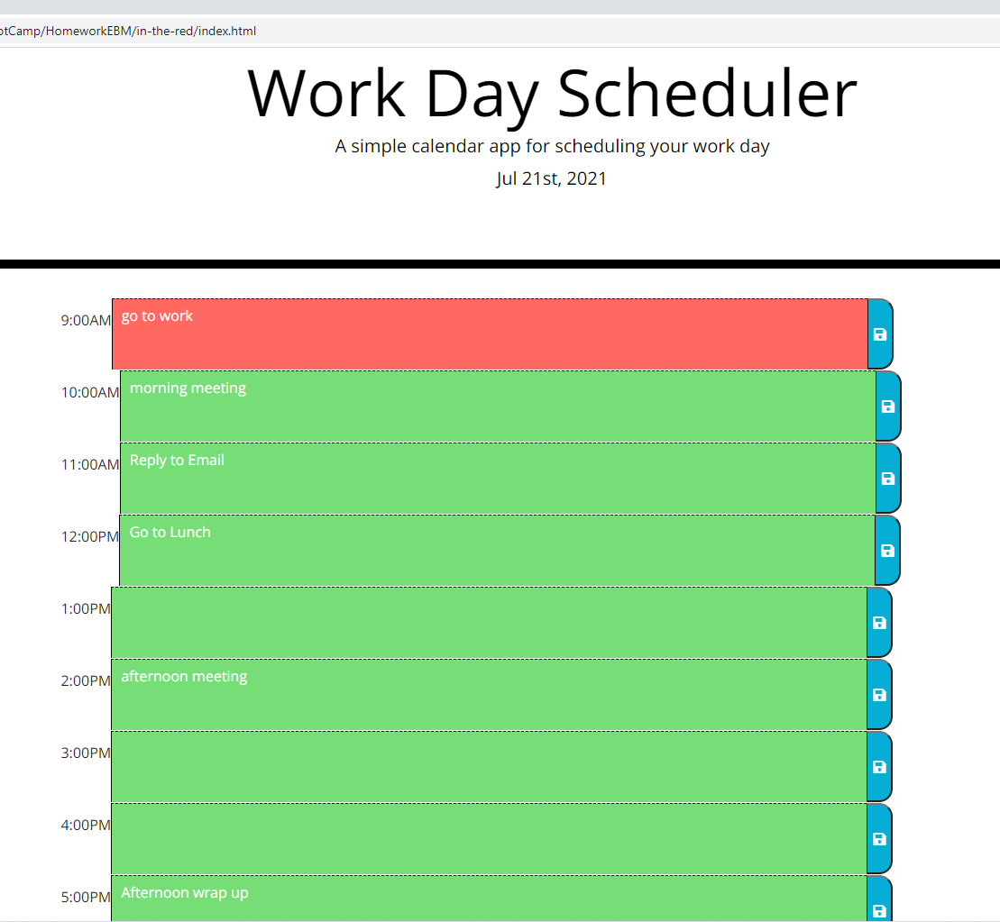

# in-the-red

This is a daily scheduler based on a 9am-5pm eight hour work day.  The time blocks turn grey when they are in the past, green for the future, and red for the present hour. If you click the save icon your text input will be saved in local storage and remain in the block upon refresh.

## About

This is my first project using moment.js, Bootstrap, and JQuery. I also incorporated some vanilla JavaScript.
The application utilizes local storage to save the day's events.

### Screencasts

Screenshot of the app during the 9am hour:

Screencast of the app functioning during the 11am hour:

Screencast of the app functioning after 6pm:

